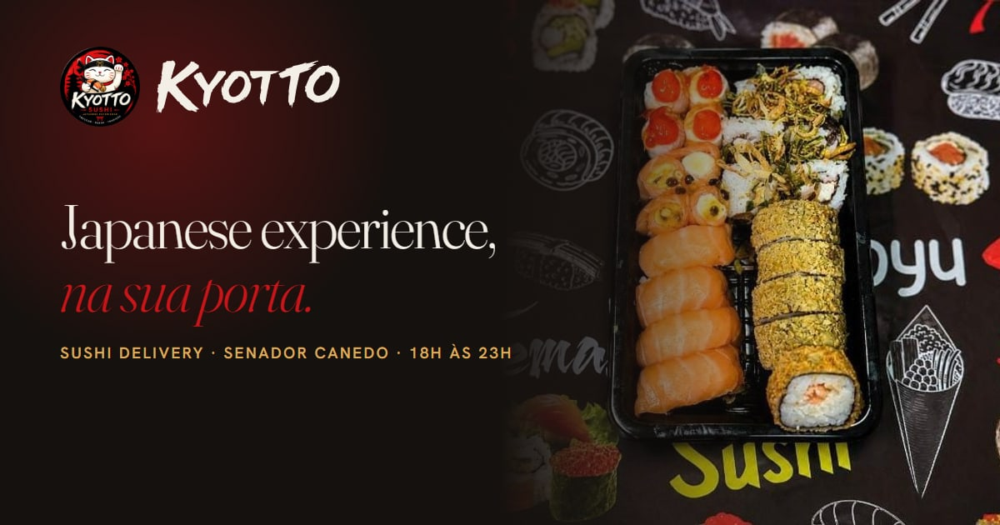

<p align="center">
  
</p>

<p align="center">
  
  
  
  
  
  
</p>

# Kyotto Sushi

**No ar:** https://kyottosushi.abramdigital.com.br

Site do **Kyotto Sushi**, sushi delivery em Senador Canedo (GO) —
*Japanese Experience · Frescor · Sabor · Tradição*.

## O problema

Em Goiânia e região, sushi "premium" é sempre salão, e delivery é sempre
popular: cardápio num app genérico, link no Instagram, foto de barca. O Kyotto
é delivery, novo (Instagram desde maio de 2026), e tem o que os outros não
têm — criações da casa: temaki em cone de harumaki, sanduíche de arroz
crocante, sushi em camadas no copo.

O app de pedidos da casa (Mata Foomi) funciona, mas ninguém o encontra no
Google: não tem título, descrição nem cardápio indexável. E o nome se confunde
com o "Kyoto" (um "t") de Goiânia, que é outra empresa.

O site resolve as três coisas: cardápio em HTML indexável, com preço e foto;
uma marca firme ("Kyotto Sushi", Senador Canedo, o gato da sorte); e dois
caminhos de pedido — o app, ou uma sacola que monta o pedido e o manda pronto
para o WhatsApp.

## Decisões

### A sacola faz a conta em centavos

`3 × 44,91` em ponto flutuante é `134,73000000000002`. Um centavo a mais na
mensagem é um cliente desconfiado do resto. `src/lib/pedido.ts` soma em
centavos inteiros, confere o pedido mínimo de R$ 40 e escreve a mensagem como
se anota um pedido na cozinha — uma linha por item, o subtotal, e a pergunta da
taxa de entrega explícita, porque ela depende do endereço e o site não sabe
calculá-la. O teste percorre **todo item × toda quantidade de 1 a 20** e **todo
par de itens**.

### O cardápio é curado, e conferido contra o app

São 17 itens, e o texto do app precisa de revisão (caixa alta, descrição
repetida entre itens, um "quantidade mínima: 100" que é erro de cadastro).
Então o cardápio vive em `business.ts`, revisado — e `npm run
cardapio:conferir` lê o app e aponta item novo, sumido ou com preço diferente.

### A marca veio do logo da casa

O letreiro "KYOTTO" em pincel foi vetorizado (potrace) a partir do logo. O
gato da sorte é ilustração de dezenas de tons: vetorizá-lo seria desenhar outro
gato. O selo em 1600 px foi recuperado do arquivo de abertura do app deles —
que estava esticado na vertical, e foi medido e desesticado.

### O nigiri é three.js puro

O gato do selo segura um nigiri de salmão; o herói também. Arroz grão a grão
(um `InstancedMesh`), veios de gordura desenhados em canvas, estúdio cozido com
`PMREMGenerator`, a fatia descendo e se curvando sobre o arroz na entrada.
Nenhum modelo baixado.

### O que o site não faz

- Não inventa prova: a casa ainda não tem avaliações públicas, e o site não tem
  seção de avaliações.
- Não promete prazo de entrega: quem informa o tempo é o app.
- Não publica endereço de rua enquanto ele não for confirmado — o app registra
  um bairro que não bate com o CEP.
- Não fica indexado no Google enquanto mora num subdomínio de apresentação.

## Bugs reais encontrados

- **Sair da home derrubava a página seguinte.** O pin do GSAP move a seção
  para dentro de um `pin-spacer`; ao desmontar a home, o React tentava remover
  a seção de um pai que não era mais o dela (`removeChild… is not a child`). Os
  testes não pegavam porque todos abriam as páginas direto pela URL. Hoje há
  teste de navegação por clique saindo da home.
- **A âncora chegava antes da página.** `/cardapio#item-combo-umi` rolava no
  quadro seguinte à navegação — mas o cardápio é carregado sob demanda e ainda
  não existia. O roteador agora espera o elemento aparecer.
- **O preview escondia bugs de produção.** O `vite preview` faz fallback de SPA
  (`/cardapio` devolvia a home). Um plugin faz o preview se comportar como a
  regra de reescrita da borda.

## Infraestrutura

```
 visitante ──HTTPS──▶ Cloudflare (proxy) ── TLS, HTTP/3, cabeçalhos de segurança,
                          │                   /rota → /rota/index.html
                          │ HTTP
                          ▼
                    S3 static website  (bucket = domínio; só aceita os IPs da Cloudflare)
                          ▲
 GitHub Actions ── OIDC ──┘  credencial temporária de 1 h — sem access key em lugar nenhum
```

Push na `main` → lint, testes, build, publicação no S3 e smoke test no ar
(ver [`DEPLOY.md`](DEPLOY.md)).

## Rodando

```bash
npm ci
npm run dev                 # desenvolvimento
npm run build               # HTML por rota, sitemap, robots, llms.txt
npm run test                # Vitest — lógica
npm run e2e                 # Playwright — contra o build, desktop e celular
npm run cardapio:conferir   # compara preços do site com o app de pedidos
npm run assets              # fotos → AVIF/WebP
npm run brand               # favicon, ícones e artes de compartilhamento
```

As regras do projeto estão em [`AGENTS.md`](AGENTS.md).

## Licença e crédito

O **código** está sob a licença [MIT](LICENSE). A marca, as fotos, os vídeos e
os textos pertencem a **Kyotto Sushi** — todos os direitos reservados; não podem
ser reutilizados sem autorização.

Desenvolvido por [Felipe Neiva](https://github.com/ffneiva) ·
[Abram Digital](https://abramdigital.com.br).
